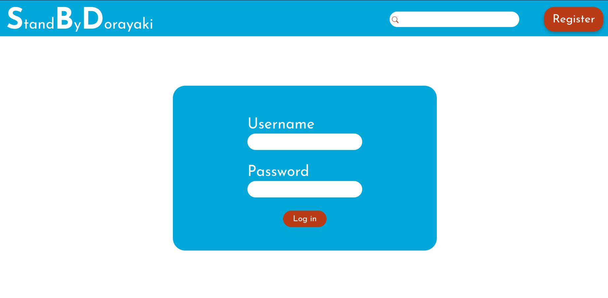
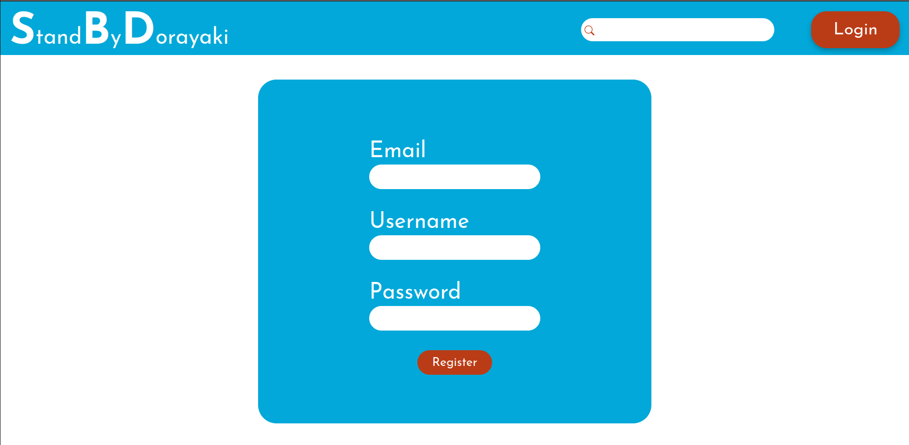
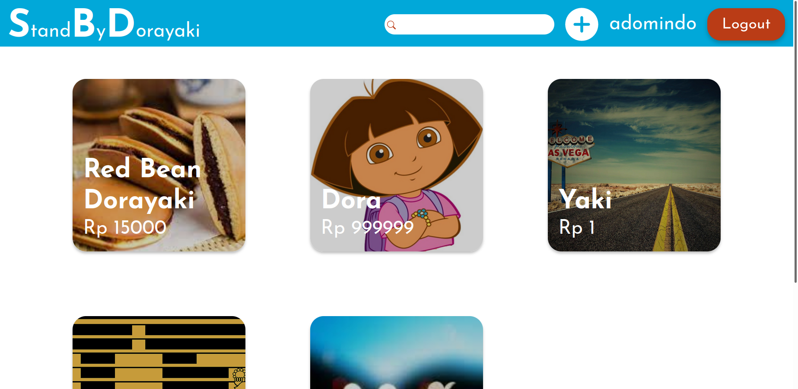
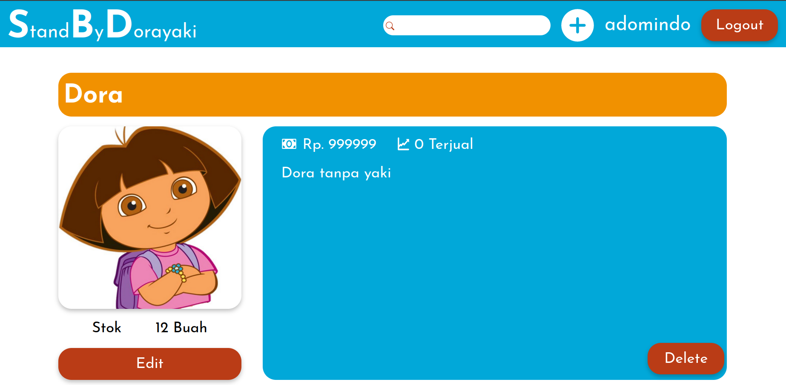
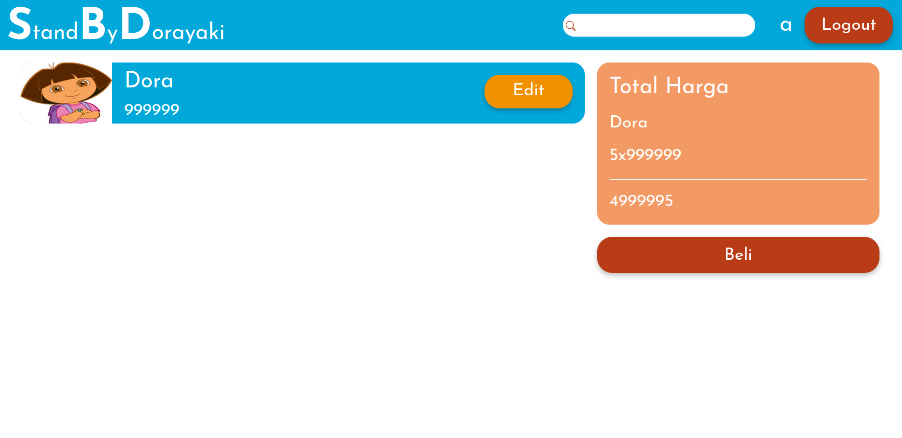

# StandByDorayaki by team spidermen-web

Created by:

- Isabella Handayani Sumantri 13519081
- Renaldi Arlin 13519114
- Jonathan Christopher Jahja 13519144

## Deskripsi aplikasi web

Doraemon sebentar lagi akan berpisah dengan dorayaki, inilah kata-kata dan karya terakhir untuk sahabat baiknya, <b><i>Stand By Dorayaki</i></b>

## Daftar requirement

- HTML
- SQLite
- PHP
- Apache Server
- XAMPP (optional)

## Cara instalasi

1. Install requirement terlebih dahulu

## Cara menjalankan server

- Dengan Menggunakan PHP Server
  ` PHP -S localhost:5000`
  Jalankan perintah di atas di directory spidermen-web.
  Voila!
  Buka `http://localhost:5000/frontend/`
   
- Dengan Menggunakan XAMPP

## Screenshot tampilan aplikasi

### Halaman Login

### Halaman <i>Register</i>

### Halaman <i>Dashboard</i>

### Halaman <i>Detail Dorayaki</i>

### Halaman Hasil!

## Penjelasan mengenai pembagian tugas masing-masing anggota
Server-side
Login : 13519114, 13519144
Register : 13519114, 13519144
Dashboard : 13519144
Detail : 13519144
Perubahan Dorayaki/Pembelian Dorayaki: 13519081

Client-side
Login : 13519114, 13519144
Register : 13519114, 13519144
Dashboard : 13519144
Detail : 13519144
Perubahan Dorayaki/Pembelian Dorayaki: 13519081
